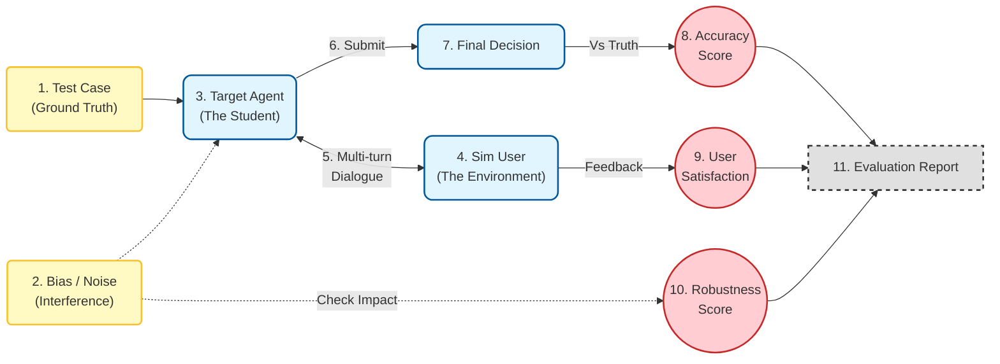
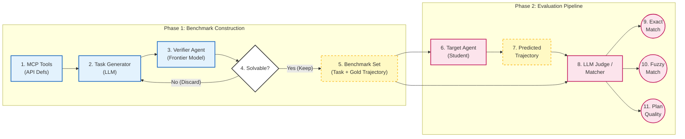
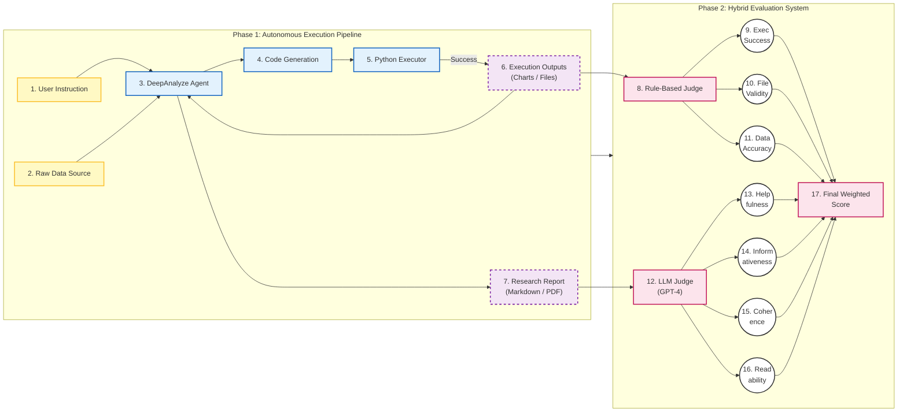

# AI Agent Evaluation Frameworks: A Comparative Survey

This repository provides a concise overview and visualization of evaluation methodologies from three significant papers in the field of AI Agents. The focus is on understanding how these agents are evaluated across different domains: Clinical Simulation, Tool Utilization, and Data Science.

---

## 1. AgentClinic: Multimodal Clinical Simulation
> **Domain:** Healthcare / Interactive Diagnosis

**Dynamic Interaction Phase** The agent operates as a physician in a virtual clinic, replacing static Q&A with active role-play. Starting with incomplete information, it must lead a multi-turn dialogue with a simulated patient and autonomously deploy diagnostic tools. This setup rigorously evaluates long-horizon reasoning and active information gathering strategies.

**Multidimensional Scoring System** Performance is evaluated through three distinct lenses:
* **Objective:** A moderator agent verifies diagnostic accuracy against ground truth case data.
* **Subjective:** The patient agent rates soft skills, including trust, professionalism, and compliance.
* **Robustness:** Adversarial noise and biases are injected to test stability and objectivity under pressure.

### Workflow Visualization



---

## 2. MCPEval: Automatic MCP-based Deep Evaluation

> **Domain:** Tool Use / Model Context Protocol

**Phase 1: Benchmark Construction** The system automates dataset creation by employing a Generator LLM to synthesize tasks based on specific tool definitions. To ensure validity, a Verifier Agent attempts to solve each generated task. Only scenarios that are successfully resolved by this frontier model are retained in the final Benchmark Set, while unsolvable ones are discarded to maintain high quality.

**Phase 2: Evaluation Pipeline** The assessment stage involves the Target Agent executing these verified tasks to produce a Predicted Trajectory. An automated LLM Judge then compares this output against the reference Gold Trajectory. The performance is quantified using metrics such as Exact Match for precision and Plan Quality for reasoning logic, providing a comprehensive score of agent capability.

### Workflow Visualization



---

## 3. DeepAnalyze: Autonomous Data Science

> **Domain:** Data Analysis / End-to-End Execution

**Autonomous Execution Phase** The target agent receives natural language instructions and raw data, autonomously managing the full loop from code generation to execution. It must not only ensure the Python code runs successfully to produce accurate charts but also synthesize these findings into a deep research report, replicating the workflow of a human data analyst.

**Hybrid Evaluation Phase** The scoring system integrates objective rules with subjective judgment. A Rule-Based Judge verifies hard metrics such as code executability, file validity, and calculation accuracy. Simultaneously, an LLM Judge assesses soft metrics regarding the research report, including its helpfulness, logical coherence, and readability. These are combined into a final weighted score to ensure the assessment is both precise and holistic.

### Workflow Visualization



---


```

```
## 4. Survey on Evaluation of LLM-based Agents

**Domain**: General Evaluation Methodologies and Frameworks

**Capability and Scenario Benchmarking Phase**
Evaluating agents requires building benchmarks from two dimensions. The first evaluates capabilities including multi-step planning, tool use, self-reflection, and memory management. The second evaluates application-specific and general scenarios by placing agents in simulated environments to test performance in real-world tasks.

**Multi-level Granular Evaluation Phase**
Evaluation frameworks analyze the complete interaction trajectory to diagnose execution quality. Evaluations occur at these levels:

1. **Stepwise Evaluation**: Examines individual actions or parameter selections for root cause analysis.
2. **Trajectory Assessment**: Compares the executed sequence of steps against the optimal path to evaluate decision logic and tool invocation order.
3. **Final Response Evaluation**: Uses model judges or objective metrics to assess output quality and consistency.
4. **Interactive Environment Testing**: Monitors agent responses to changing states through a simulation framework.

### Workflow Visualization

```mermaid
graph LR
    classDef input fill:#fff9c4,stroke:#fbc02d,stroke-width:2px,rx:5,ry:5;
    classDef phase1 fill:#e3f2fd,stroke:#1565c0,stroke-width:2px;
    classDef phase2 fill:#fce4ec,stroke:#c2185b,stroke-width:2px;
    classDef actor fill:#f3e5f5,stroke:#7b1fa2,stroke-width:2px;
    classDef score fill:#ffcdd2,stroke:#c62828,stroke-width:2px,rx:50,ry:50;

    subgraph Phase1 ["Phase 1: Task and Environment Setup"]
        Tasks["1. Benchmark Tasks"]:::input
        Agent["2. Target Agent"]:::actor
        Env["3. Dynamic Environment"]:::phase1

        Tasks --> Agent
        Agent <--> Env
    end

    subgraph Phase2 ["Phase 2: Granular Evaluation"]
        Trace["4. Execution Trajectory"]:::input
        StepEval["5. Stepwise Eval"]:::phase2
        TrajEval["6. Trajectory Eval"]:::phase2
        FinalEval["7. Final Response Eval"]:::phase2

        Env --> Trace
        Trace --> StepEval
        Trace --> TrajEval
        Trace --> FinalEval
    end

    M1["8. Capability Scores"]:::score
    M2["9. Efficiency Metrics"]:::score

    StepEval --> M1
    TrajEval --> M1
    FinalEval --> M1

    StepEval --> M2
    TrajEval --> M2
    FinalEval --> M2
