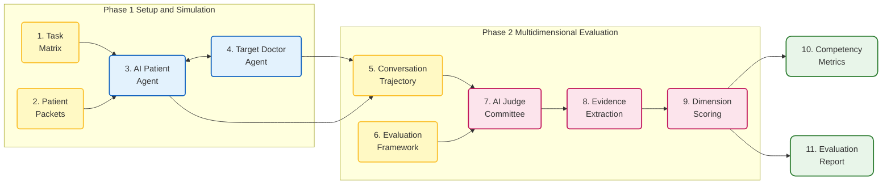
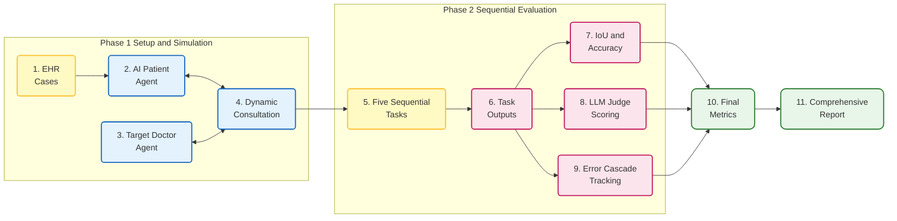
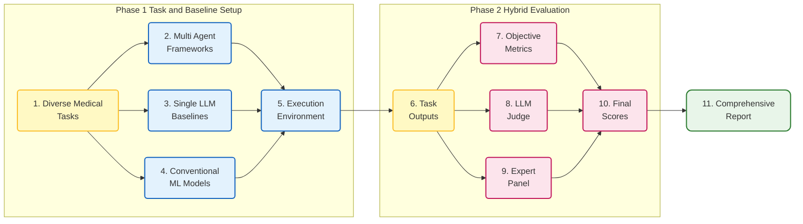

## 6. MEDPI: Medical Interactive Agent Evaluation

**Domain**: Medical Dialogue Simulation and Clinical Evaluation

**Environment Construction and Dialogue Simulation Phase**
The framework utilizes synthetic electronic health records to construct patient packets. AI patients are instantiated based on these patient packets, integrated with memory and emotion systems. The evaluation task is defined by a matrix comprising encounter reasons and encounter objectives. The target agent acts as a doctor, conducting multi-turn text-based consultations with the AI patient to generate an interaction trajectory.

**Multidimensional Fine-Grained Evaluation Phase**
The evaluation framework contains 105 fine-grained dimensions mapped to medical competency categories. A committee of large language model judges conducts internal discussions on the dialogue trajectories and extracts evidence. Based on the discussion results, the judges assign discrete scores from one to four across all dimensions. The system ultimately outputs a comprehensive evaluation report containing quantitative scores and associated evidence.

### Workflow Visualization

---

## 7. MedChain: Continuous Clinical Decision-Making Agent Evaluation

**Domain**: Clinical Decision-Making and Continuous Interactive Evaluation

**Dynamic Interaction Testing**
A local model acts as a standardized patient and the target agent acts as a doctor. They engage in multi-turn dialogues to assess the agent's ability to dynamically gather information and provide personalized care.

**Continuous Execution and Hybrid Scoring**
Agents sequentially complete five tasks including triage, history-taking, examination, diagnosis, and treatment. The output of one stage serves as the input for the next to test error propagation. Scoring uses hybrid metrics where Intersection over Union evaluates the triage and treatment stages, while a large language model judge performs text matching and comprehensive scoring for the examination and diagnosis stages based on clinical standards.

---

## 8. MedAgentBoard Comprehensive Medical Multi Agent Collaboration Evaluation

**Domain**: Medical Multimodal Tasks and Multi Agent Evaluation

**Heterogeneous Task and Benchmark Construction Phase**
The framework constructs four medical tasks including medical question answering medical record summary generation electronic health record prediction and clinical workflow automation. To evaluate system performance this benchmark tests various multi agent collaboration frameworks and introduces single large language models and task specific traditional machine learning models as strong baselines.

**Hybrid Metrics and Human Intervention Evaluation Phase**
Differentiated evaluation standards are adopted for tasks with distinct modalities and complexities. Multiple choice and predictive model tasks use objective quantitative metrics like accuracy or area under the receiver operating characteristic curve. Open ended question answering uses a large language model judge to evaluate semantic correctness and factual consistency. Clinical workflow automation tasks introduce a multidisciplinary expert team for manual review to assess code execution rate and clinical validity.

---
