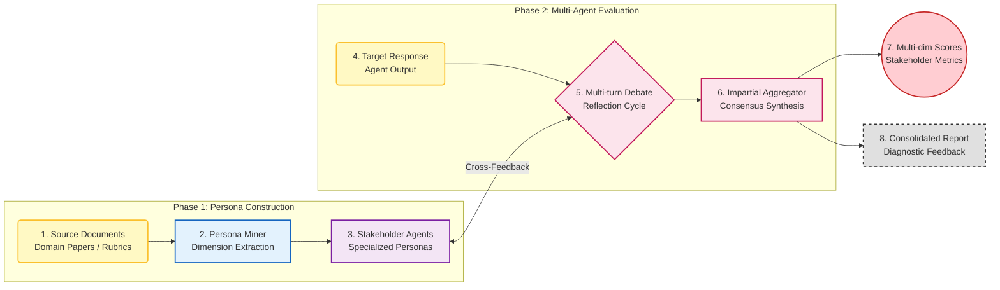

## 6. MAJ-EVAL: Multi-Agent-as-Judge

**Domain**: General / Multi-dimensional Human Alignment

**Persona Construction Phase**
This phase utilizes a Persona Miner to automate the creation of evaluator profiles. Instead of relying on manual prompts, the system analyzes source documents such as research papers or official grading rubrics to extract specific evaluation dimensions. These dimensions are then used to instantiate multiple stakeholder agents. Each agent represents a distinct professional or user perspective, such as a domain expert, an end-user, or a technical auditor, ensuring the evaluation is grounded in realistic and diverse criteria.

**Collaborative Evaluation Phase**
The framework employs a structured Multi-round Debate and Reflection mechanism to process the target agent's response. The workflow consists of three sub-steps:

1. **Independent Assessment**: Each stakeholder agent provides an initial score and feedback based strictly on their assigned persona and expertise.
2. **Interactive Debate**: Agents exchange their evaluations and engage in a multi-turn discussion. This process forces the agents to defend their reasoning, identify overlooked details in the response, and challenge the biases of other participants.
3. **Reflection and Revision**: Following the debate, agents reflect on the group discussion and update their individual evaluations to reach a more nuanced conclusion.

**Final Synthesis and Aggregation**
An Impartial Aggregator agent collects the final reflections from all stakeholders. This aggregator identifies key areas of consensus and unresolved points of contention. The output includes a consolidated diagnostic report and a set of multi-dimensional scores. This method significantly reduces common single-judge issues such as self-preference bias and position bias while providing high-quality qualitative feedback.

### Workflow Visualization

