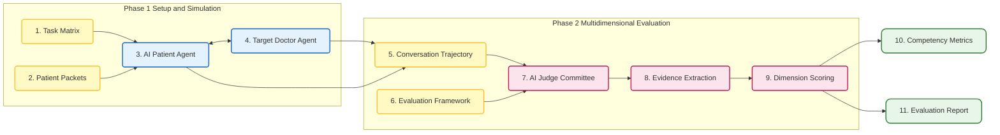

## 7. MEDPI: Medical Interactive Agent Evaluation

**Domain**: Medical Dialogue Simulation and Clinical Evaluation

**Environment Construction and Dialogue Simulation Phase**
The framework utilizes synthetic electronic health records to construct patient packets. AI patients are instantiated based on these patient packets, integrated with memory and emotion systems. The evaluation task is defined by a matrix comprising encounter reasons and encounter objectives. The target agent acts as a doctor, conducting multi-turn text-based consultations with the AI patient to generate an interaction trajectory.

**Multidimensional Fine-Grained Evaluation Phase**
The evaluation framework contains 105 fine-grained dimensions mapped to medical competency categories. A committee of large language model judges conducts internal discussions on the dialogue trajectories and extracts evidence. Based on the discussion results, the judges assign discrete scores from one to four across all dimensions. The system ultimately outputs a comprehensive evaluation report containing quantitative scores and associated evidence.

### Workflow Visualization

