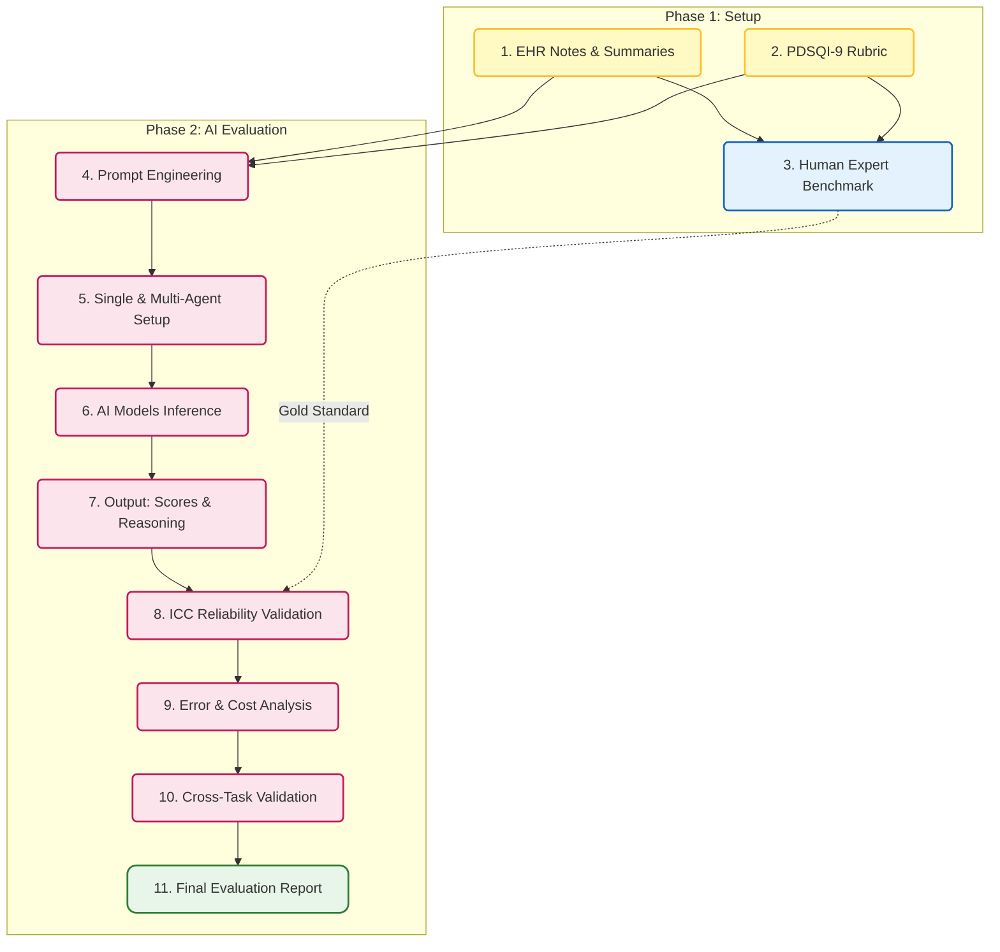
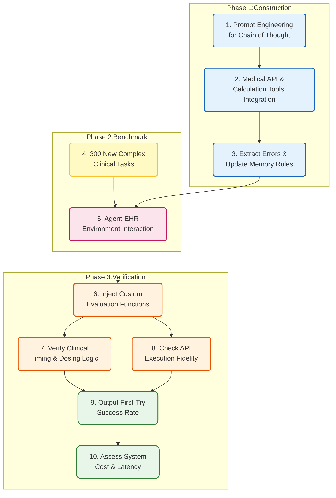
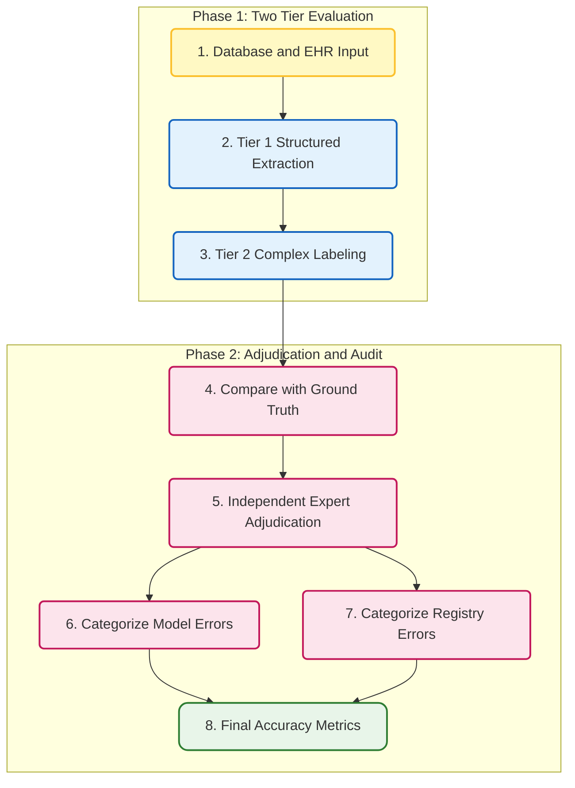

## 11. Medical LLM-as-a-Judge: Automated Clinical Summary Evaluation

**Domain** : Clinical Summarization and Automated Evaluation

Link: https://doi.org/10.1101/2025.04.22.25326219

**Benchmark Alignment & Single-Model Scoring**

This study employs Large Language Models (LLMs) as judges to evaluate the quality of medical record summaries. The evaluation uses the PDSQI-9 scale, validated by human experts, as the benchmark. By inputting the original records, candidate summaries, and scoring rubrics, the system prompts the LLM to generate multi-dimensional scores. Researchers then calculate the Intraclass Correlation Coefficient (ICC) between LLM and expert ratings to measure the consistency between machine and human judgment.

**Multi-Agent Collaboration & Strategy Optimization**

The research further introduces a multi-agent discussion framework. Agents are assigned specific roles—such as "high-score" or "low-score" biased evaluators—to engage in cross-debates regarding summary quality. A coordinator then synthesizes these perspectives into a consensus score. Additionally, the study tests zero-shot, few-shot, and preference optimization strategies to identify the automated evaluation approach that most closely aligns with human cognitive standards.
### Workflow Visualization



---
## 12.MedAgent Bench v2: Medical LLM Agent Design
**Domain: EHR Agent Evaluation**

link：https://www.worldscientific.com/doi/10.1142/9789819824755_0025

**Agent Construction & Optimization**

This phase focuses on optimizing medical agents by refining prompt engineering and tool integration. The system requires agents to generate step-by-step plans before taking any action. Agents are equipped with specialized tools for querying FHIR standard APIs, performing mathematical calculations, and formatting outputs. Additionally, a memory feedback mechanism was introduced, allowing agents to extract lessons from past mistakes and update their system prompts, enabling strategy adaptation across different tasks.

**Clinical Task Testing & Evaluation**

The evaluation goes beyond standard benchmarks by introducing 300 new, complex, multi-step clinical tasks developed with the help of human doctors to test generalization. For each task, the system uses custom-coded evaluation functions to automatically verify the agent's clinical reasoning logic and the accuracy of its API calls. The core metric for the final assessment is the First-Trial Success Rate.
### Workflow Visualization



---
## 13. RadOnc-GPT: Clinical Outcomes Labeling Agent
**Domain: Clinical Outcomes Labeling**

Link ：https://arxiv.org/html/2509.25540v1

**Two-Level Task Evaluation**

This study uses a two-level strategy to evaluate the medical AI agent. The first level focuses on structured data extraction,testing how accurately the agent retrieves basic patient information and radiotherapy plans from the database. These results are checked directly against the source data. The second level involves "complex clinical outcome labeling." Here, the agent must analyze both structured records and unstructured clinical notes to independently identify conditions like radiation necrosis or cancer recurrence.

**Expert Review & Data Auditing**

When the agent’s results in the second level differ from existing human-made labels in the registry, independent doctors are brought in to judge the discrepancy. These experts categorize each difference as either areal model error or a baseline erro in the original data. This evaluation process does more than just measure the agent's performance; it also acts as a reverse audit, helping to identify and correct many human labeling errors or omissions in existing medical databases.
### Workflow Visualization



---
## 14. DSAEval: Data Science Agent Evaluation
**Domain: Data Science Agent Evaluation**

Link: https://arxiv.org/pdf/2601.13591

**Multimodal Interaction & Task Execution**
The system creates a multi-round query environment based on real-world datasets. Agents receive multimodal inputs (both text and visuals), simulating the iterative process of an actual data science project. They are required to step-by-step generate reasoning logic, executable code, and final results.

**Multi-Dimensional Judge Evaluation**
The evaluation framework employs an LLM-as-a-judge to score the agent’s entire output trajectory across three dimensions: reasoning, code quality, and final outcomes. By moving beyond simple "single-answer" comparisons, this mechanism fully quantifies the agent's comprehensive performance when solving open-ended data science problems.

```mermaid
graph LR
    classDef phase1 fill:#e3f2fd,stroke:#1565c0,stroke-width:2px,rx:5,ry:5;
    classDef phase2 fill:#fce4ec,stroke:#c2185b,stroke-width:2px,rx:5,ry:5;
    classDef input fill:#fff9c4,stroke:#fbc02d,stroke-width:2px,rx:5,ry:5;
    classDef report fill:#e8f5e9,stroke:#2e7d32,stroke-width:2px,rx:10,ry:10;

    subgraph P1 [ "Phase 1: Environment and Interaction" ]
        direction LR
        N1["1. Real World Datasets<br/>Text and Vision"]:::input
        N2["2. Multimodal<br/>Perception"]:::phase1
        N3["3. Multi Query<br/>Iterative Interaction"]:::phase1
        N4["4. Code and Reasoning<br/>Generation"]:::phase1
        N5["5. Execution Outputs<br/>and Trajectories"]:::phase1
        
        N1 --> N2
        N2 --> N3
        N3 --> N4
        N4 --> N5
    end

    subgraph P2 [ "Phase 2: Multi Dimensional Evaluation" ]
        direction LR
        N6["6. LLM as a Judge<br/>System"]:::phase2
        N7["7. Dimension 1<br/>Reasoning Logic"]:::phase2
        N8["8. Dimension 2<br/>Code Quality"]:::phase2
        N9["9. Dimension 3<br/>Final Results"]:::phase2
        N10["10. Trajectory Scoring<br/>and Aggregation"]:::phase2
        N11["11. Comprehensive<br/>Evaluation Report"]:::report
        
        N6 --> N7
        N6 --> N8
        N6 --> N9
        N7 & N8 & N9 --> N10
        N10 --> N11
    end

    N5 --> N6
```

---
