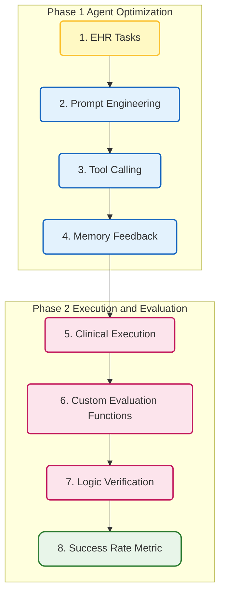

## 11. Medical LLM-as-a-Judge: Automated Clinical Summary Evaluation

**Domain** : Clinical Summarization and Automated Evaluation

Link: https://doi.org/10.1101/2025.04.22.25326219

**Benchmark Alignment & Single-Model Scoring**

This study employs Large Language Models (LLMs) as judges to evaluate the quality of medical record summaries. The evaluation uses the PDSQI-9 scale, validated by human experts, as the benchmark. By inputting the original records, candidate summaries, and scoring rubrics, the system prompts the LLM to generate multi-dimensional scores. Researchers then calculate the Intraclass Correlation Coefficient (ICC) between LLM and expert ratings to measure the consistency between machine and human judgment.

**Multi-Agent Collaboration & Strategy Optimization**

The research further introduces a multi-agent discussion framework. Agents are assigned specific roles—such as "high-score" or "low-score" biased evaluators—to engage in cross-debates regarding summary quality. A coordinator then synthesizes these perspectives into a consensus score. Additionally, the study tests zero-shot, few-shot, and preference optimization strategies to identify the automated evaluation approach that most closely aligns with human cognitive standards.
### Workflow Visualization

---
## 12.MedAgent Bench v2: Medical LLM Agent Design
**Domain: EHR Agent Evaluation**

link：https://www.worldscientific.com/doi/10.1142/9789819824755_0025

**Agent Construction & Optimization**

This phase focuses on optimizing medical agents by refining prompt engineering and tool integration. The system requires agents to generate step-by-step plans before taking any action. Agents are equipped with specialized tools for querying FHIR standard APIs, performing mathematical calculations, and formatting outputs. Additionally, a memory feedback mechanism was introduced, allowing agents to extract lessons from past mistakes and update their system prompts, enabling strategy adaptation across different tasks.

**Clinical Task Testing & Evaluation**

The evaluation goes beyond standard benchmarks by introducing 300 new, complex, multi-step clinical tasks developed with the help of human doctors to test generalization. For each task, the system uses custom-coded evaluation functions to automatically verify the agent's clinical reasoning logic and the accuracy of its API calls. The core metric for the final assessment is the First-Trial Success Rate.
### Workflow Visualization

---
