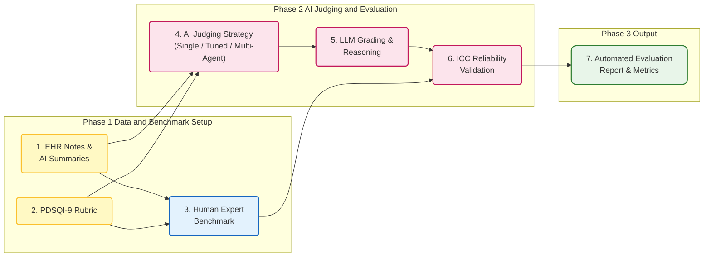

## 7. Medical LLM-as-a-Judge: Automated Clinical Summary Evaluation

**Domain** : Clinical Summarization and Automated Evaluation

Link: https://doi.org/10.1101/2025.04.22.25326219

**Benchmark Alignment & Single-Model Scoring**

This study employs Large Language Models (LLMs) as judges to evaluate the quality of medical record summaries. The evaluation uses the PDSQI-9 scale, validated by human experts, as the benchmark. By inputting the original records, candidate summaries, and scoring rubrics, the system prompts the LLM to generate multi-dimensional scores. Researchers then calculate the Intraclass Correlation Coefficient (ICC) between LLM and expert ratings to measure the consistency between machine and human judgment.

**Multi-Agent Collaboration & Strategy Optimization**

The research further introduces a multi-agent discussion framework. Agents are assigned specific roles—such as "high-score" or "low-score" biased evaluators—to engage in cross-debates regarding summary quality. A coordinator then synthesizes these perspectives into a consensus score. Additionally, the study tests zero-shot, few-shot, and preference optimization strategies to identify the automated evaluation approach that most closely aligns with human cognitive standards.
### Workflow Visualization

---
